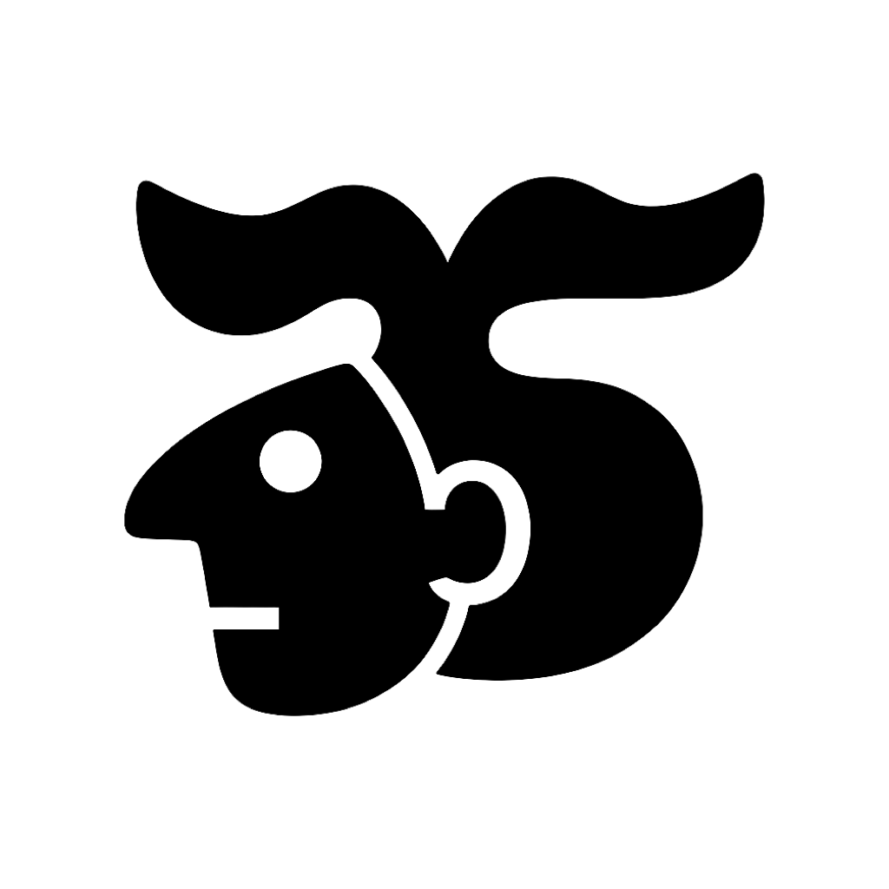
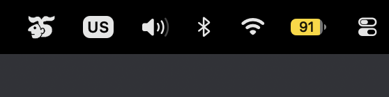

# SLEEPNOT

<p align="center">
  
</p>

<p align="center">
  
</p>

<p align="center">
  <a href="https://github.com/us/sleepnot/releases/latest"></a>
  <a href="https://github.com/us/sleepnot/actions/workflows/ci.yml"></a>
  
  
</p>

<p align="center">Tiny macOS menu bar utility. Keeps your Mac awake, even with the lid closed, while letting the display sleep normally. Sleep is for humans.</p>

<p align="center">
  <a href="https://github.com/us/sleepnot/releases/latest">Download latest release</a>
</p>

## Install

Via Homebrew (own tap):

```sh
brew tap us/sleepnot
brew install --cask sleepnot
```

Or download `SLEEPNOT-<version>.dmg` (drag to Applications) or `SLEEPNOT-<version>.zip` from [Releases](https://github.com/us/sleepnot/releases/latest). Universal binary: Apple Silicon and Intel.

## Behavior

- **ON**: blocks idle system sleep via `ProcessInfo.beginActivity([.idleSystemSleepDisabled])`. The display can still turn off. Also runs `pmset disablesleep 1` so closing the lid does not sleep the Mac.
- **OFF**: normal macOS sleep behavior (`disablesleep 0`).

Closing the lid cannot be blocked without root, so the first time you turn it ON, macOS asks for your password once. That installs `/etc/sudoers.d/sleepnot`, which allows only `pmset disablesleep 0` and `pmset disablesleep 1` without a password. Every later toggle is silent. If you decline, SLEEPNOT still blocks idle sleep and the menu says closing the lid may sleep.

A closed Mac that stays awake gets warm: turn SLEEPNOT OFF before putting the laptop in a bag. To remove the rule: `sudo rm /etc/sudoers.d/sleepnot`.

No window, no Dock icon (`LSUIElement`), no accounts, no network, no dependencies.

## Usage

- **Left click** the menu bar icon: toggle on/off indefinitely.
- **Right click** (or control+click): pick a duration (Indefinitely, 5 / 15 / 30 minutes, 1 / 2 / 5 hours), check for updates, or quit.

Timed runs stop automatically and the icon flips back. The menu status line reads "Sleep allowed.", "Awake. Sleep is for humans.", or the remaining time ("Awake for 5 min more.").

SLEEPNOT never blocks display sleep, never wakes a sleeping Mac, and holds no state between launches. Every launch starts OFF (and clears a leftover `disablesleep` from a crashed run).

## Icons

| OFF (hollow) | ON (filled) |
|---|---|
|  |  |

## Project

```
Sleepnot/
├── SleepnotApp.swift      # NSStatusItem, icon, menu (left toggle, right durations)
├── AwakeController.swift  # single ProcessInfo activity, optional timer
├── Updater.swift          # version check plus one-click install, no dependencies
├── IconOff.png / IconOn.png
```

424 lines of Swift plus icon files. No third-party code.

## Build from source

Requires Xcode on macOS 13+.

```sh
make build   # Release build into build/Release/SLEEPNOT.app
make verify  # static guarantees (no display assertion, agent-only app)
make zip     # distributable zip plus its sha256
open build/Release/SLEEPNOT.app
```

## Release process

1. Bump `MARKETING_VERSION` in the Xcode project.
2. Update `version` in `Casks/sleepnot.rb` to match.
3. Commit, tag `v<version>`, push the tag. The release workflow builds the zip and dmg and publishes the GitHub Release.
4. Paste the release zip sha256 into `Casks/sleepnot.rb`.

## Privacy

One network call: version check against GitHub Releases (on launch, daily, and when you pick Check for Updates). No analytics, no file or process inspection, no special permissions. It creates one idle-sleep assertion while ON and removes it when OFF.

## License

MIT, see `LICENSE`.
